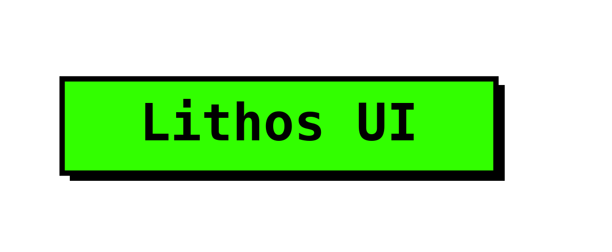

# Lithos UI



**Build frontends that refuse to break.**

Lithos UI is a free, neo-brutalist React component library engineered with absolute structural integrity. It ditches fragile CSS gaps and soft shadows in favor of hard math, rigid grids, and high-contrast accessibility.

## Core Architecture

### 1. The Zero-Gap Policy

Modern web layouts often rely on the CSS `gap` property, which can cause unpredictable overflow and sub-pixel rendering issues on complex nested grids.
Lithos UI strictly enforces a **Zero-Gap Architecture**. All structural spacing is handled via a combination of explicit parent negative margins (e.g., `-m-4`) and direct child margins (`m-4`), guaranteeing that layouts snap cleanly across breakpoints without viewport bleed.

### 2. YIQ Biological Contrast Engine

The dynamic theme engine does not rely on static "Light/Dark" toggle classes. Instead, it uses the **YIQ Luminance formula**—a mathematical calculation based on human optical sensitivity (heavily weighting the green spectrum).
When you inject a custom HEX code, the engine calculates the perceived biological brightness and automatically forces all nested typography and active UI elements to absolute `#000000` or `#FFFFFF` to ensure maximum WCAG compliance.

### 3. Universal Specificity Overrides

CSS specificity wars ruin dynamic themes. Lithos UI utilizes a Javascript-injected Universal Override block (`<style>`) targeting `*, :root, .dark, .obsidian` with `!important` flags. This guarantees that user-selected dynamic tokens completely overpower hardcoded Tailwind classes, ensuring instant, glitch-free repaints.

---

## Installation

Lithos UI is not an NPM black-box dependency. It is a **Code Ownership Kit**. You copy the raw blocks into your project so you retain absolute control over the markup.

**Starting a new project?**
Click the green **"Use this template"** button at the top of the repository to instantly generate a fresh React app with the global design tokens and Theme Engine pre-configured.

**Adding to an existing project?**

1. Ensure your project is running **React** and **Tailwind CSS v3+**.
2. Copy the `index.css` global tokens into your main stylesheet.
3. Drop the components from the `/components` folder into your standard architecture.

## Global Design Tokens

The entire visual weight of the library is controlled by these 7 variables. Modify them in your `index.css` or manipulate them via Javascript for live-theming.

```css
:root {
  --lithos-bg: #ffffff;          /* The deep background */
  --lithos-text: #000000;        /* Primary typography */
  --lithos-border: #000000;      /* Structural lines */
  --lithos-accent: #00FF00;      /* The loud brand color */
  --lithos-accent-text: #000000; /* Auto-calculated by YIQ */
  --lithos-surface: #ffffff;     /* Card backgrounds */
  --lithos-shadow: rgba(0,0,0,1);/* Brutalist shadow offset */
}
```

## Obsidian Mode (Dark Theme)

Lithos UI includes a native Dark Mode trigger. Simply apply the `.obsidian` class to the document body or top-level wrapper, and the global tokens will instantly invert, while respecting your primary `--lithos-accent` color.

### License

Lithos UI is free for unlimited commercial and personal projects. You may not repackage, resell, or redistribute the component source code as your own UI kit or template. See LICENSE.md for full details.
